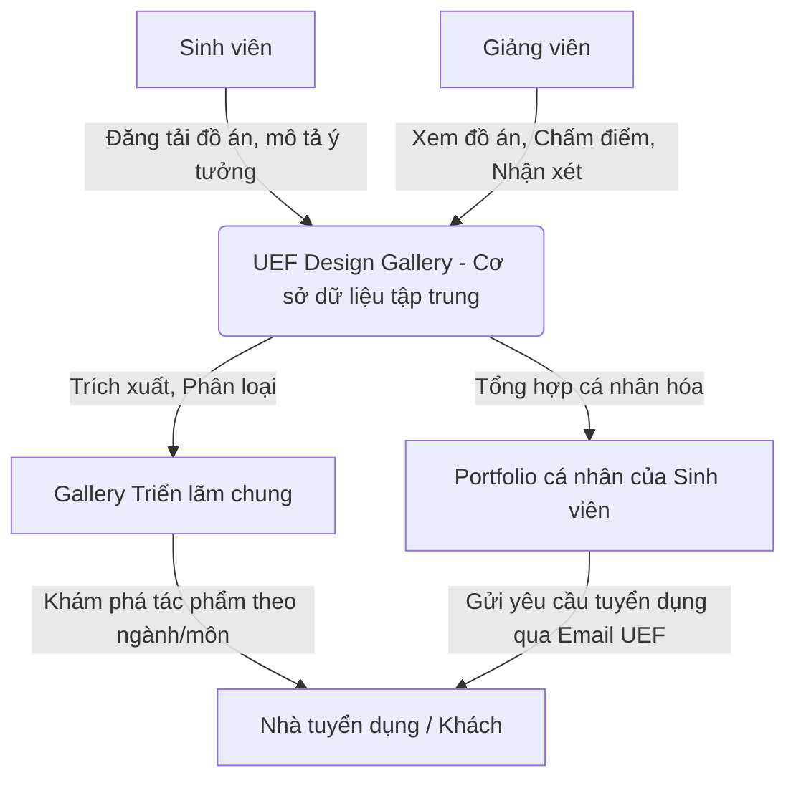
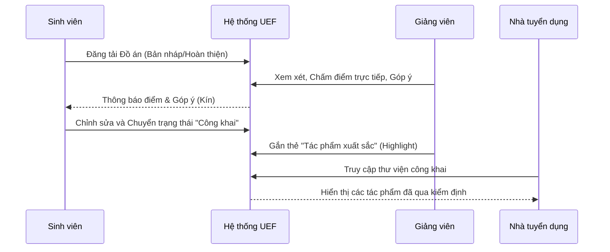

# ỨNG DỤNG NỀN TẢNG E-PORTFOLIO TÍCH HỢP ĐÁNH GIÁ HỌC THUẬT TRONG ĐÀO TẠO THIẾT KẾ ĐỒ HỌA: BÀI TOÁN TỪ UEF DESIGN GALLERY

**Tên và học vị tác giả:** (Điền thông tin tác giả của bạn)  
**Nơi công tác:** Khoa Thiết kế Đồ họa, Trường Đại học Kinh tế - Tài chính Thành phố Hồ Chí Minh (UEF)  
**Email:** (Điền email của bạn)

---

## Tóm tắt
Bài viết này nghiên cứu và đề xuất mô hình ứng dụng nền tảng E-Portfolio nội bộ (UEF Design Gallery) dành riêng cho sinh viên chuyên ngành Thiết kế Đồ họa. Trong khi các nền tảng danh mục đầu tư đại chúng (Behance, Dribbble) mang lại khả năng tiếp cận rộng rãi, chúng bộc lộ nhiều hạn chế trong môi trường học thuật như: thiếu tích hợp quy trình đánh giá, không phân loại theo khung chương trình đào tạo, và thiếu cơ chế xác thực danh tính sinh viên đối với nhà tuyển dụng. Dựa trên việc phân tích mã nguồn và thực nghiệm mô hình hệ thống thực tế, nghiên cứu trình bày cấu trúc của một nền tảng kết hợp giữa không gian triển lãm trực tuyến, hệ thống chấm điểm trực tiếp của giảng viên và cổng kết nối nhà tuyển dụng. Kết quả nghiên cứu cung cấp một giải pháp thiết thực, giúp sinh viên hệ thống hóa hồ sơ năng lực (portfolio) chuyên nghiệp, tối ưu hóa công tác đánh giá của giảng viên, và nâng cao uy tín của cơ sở đào tạo với doanh nghiệp.  
*Từ khoá:* E-Portfolio, giáo dục thiết kế đồ họa, UEF Design Gallery, đánh giá học thuật, Behance.

## THE PAPER TITLE IN ENGLISH
**APPLICATION OF INTEGRATED ACADEMIC EVALUATION E-PORTFOLIO PLATFORMS IN GRAPHIC DESIGN EDUCATION: THE CASE OF UEF DESIGN GALLERY**

## Abstract
This paper investigates and proposes the application model of an internal E-Portfolio platform (UEF Design Gallery) tailored for Graphic Design students. While public portfolio platforms (Behance, Dribbble) offer broad accessibility, they reveal limitations in an academic context, such as the lack of integrated evaluation processes, absence of curriculum-based categorization, and unverified student identities for recruiters. Based on source code analysis and practical system modeling, this research presents the architecture of a platform combining an online exhibition space, a direct grading system for lecturers, and an employer connection portal. The findings provide a practical solution that helps students systematize their professional portfolios, optimizes the lecturers' evaluation workflow, and enhances the institution's reputation among enterprises.  
*Keywords:* E-Portfolio, graphic design education, UEF Design Gallery, academic evaluation, Behance.

---

## 1. Giới thiệu

### 1.1. Bối cảnh chuyển đổi số và yêu cầu đặc thù của ngành Thiết kế
Trong kỷ nguyên số hóa giáo dục đại học, việc đánh giá năng lực người học đang dần chuyển dịch từ các bài thi truyền thống sang việc đánh giá dựa trên dự án (Project-based learning) và hồ sơ năng lực (Portfolio). Đặc biệt đối với khối ngành Thiết kế Đồ họa, Portfolio không chỉ là một tài liệu xin việc sau khi tốt nghiệp mà còn là công cụ định danh nghề nghiệp, phản ánh cả một quá trình rèn luyện tư duy thẩm mỹ và kỹ năng kỹ thuật của sinh viên. 

Tuy nhiên, thực trạng hiện nay tại nhiều cơ sở đào tạo cho thấy sự đứt gãy trong hệ sinh thái số: sinh viên nộp bài tập qua Hệ thống quản lý học tập (LMS) để lấy điểm, sau đó lại phải tự xây dựng hồ sơ năng lực trên các nền tảng thương mại bên thứ ba như Behance hay Dribbble để tiếp cận nhà tuyển dụng. Sự phân mảnh này dẫn đến việc nhà trường mất đi một kho dữ liệu học thuật vô giá, trong khi sinh viên tốn gấp đôi thời gian cho việc quản lý tác phẩm.

### 1.2. Mục tiêu và phạm vi nghiên cứu
Nghiên cứu này ra đời nhằm giải quyết bài toán trên thông qua việc thiết kế và phát triển một hệ thống E-Portfolio tích hợp mang tên **UEF Design Gallery**. Mục tiêu của nghiên cứu là xây dựng và kiểm chứng một mô hình nền tảng lai (hybrid platform) - nơi không chỉ phục vụ việc trưng bày tác phẩm đạt chuẩn chuyên nghiệp, mà còn số hóa quy trình chấm điểm đồ án của giảng viên, và cung cấp một cơ chế xác thực năng lực minh bạch cho nhà tuyển dụng.

Đối tượng nghiên cứu là mô hình kiến trúc phần mềm, luồng trải nghiệm người dùng (UX) của hệ thống E-Portfolio nội bộ, đồng thời thực hiện các so sánh mang tính định tính và định lượng nhằm làm nổi bật tính ưu việt của hệ thống này so với các nền tảng thương mại hiện hành.

---

## 2. Cơ sở lý thuyết

### 2.1. E-Portfolio và vai trò trong Giáo dục bậc Đại học
Theo Lorenzo và Ittelson (2005) [1], E-Portfolio (Hồ sơ điện tử) là tập hợp các minh chứng về quá trình học tập, năng lực và thành tựu của người học trên nền tảng kỹ thuật số. Trong giáo dục thiết kế, E-Portfolio đóng hai vai trò cốt lõi:
1. **Không gian lưu trữ (Workspace/Storage):** Nơi ghi nhận quá trình hình thành ý tưởng, các bản nháp, và sự phản hồi từ giảng viên.
2. **Không gian trình diễn (Showcase):** Nơi tuyển chọn và trưng bày những tác phẩm hoàn thiện nhất, phản ánh năng lực cốt lõi của sinh viên.

### 2.2. Khoảng trống giữa Hệ thống LMS và Nền tảng Đại chúng
Trong bối cảnh giáo dục sáng tạo, tồn tại hai thái cực không thể giao thoa: Hệ thống LMS truyền thống (Blackboard, Moodle, Canvas) và Các nền tảng thương mại (Behance, Dribbble).

- **LMS (Tập trung vào Sư phạm):** Làm rất tốt vai trò giao bài, thiết lập rubric (tiêu chí đánh giá) và quản lý điểm số. Tuy nhiên, giao diện của LMS thường đóng kín, mang tính hành chính, không hỗ trợ trưng bày trực quan theo dạng lưới (grid) hay masonry, và quan trọng nhất là nhà tuyển dụng không thể truy cập để xem tác phẩm.
- **Nền tảng thương mại (Tập trung vào Trưng bày):** Xuất sắc trong việc tạo ra các bộ sưu tập bắt mắt. Tuy nhiên, chúng bộc lộ nhiều điểm yếu về mặt sư phạm:
  - **Thiếu tính sư phạm (Pedagogical Disconnect):** Giảng viên không thể chấm điểm chính thức hoặc để lại nhận xét bảo mật (private feedback).
  - **Áp lực hoàn hảo thay vì quá trình (Polish over Process):** Thuật toán của các nền tảng đại chúng chỉ ưu tiên đẩy lên xu hướng những sản phẩm hoàn thiện nhất. Điều này đi ngược lại triết lý giáo dục là trân trọng cả quá trình thử nghiệm và sai sót của sinh viên [2].
  - **Bảo mật dữ liệu (Data Privacy):** Việc bắt buộc sinh viên đưa dữ liệu học tập lên nền tảng bên thứ ba tiềm ẩn rủi ro về quyền riêng tư và sở hữu trí tuệ.
  - **Tính xác thực (Authenticity):** Không có cơ chế nào để nhà tuyển dụng xác minh một dự án trên Behance là đồ án chính quy đã được hội đồng nhà trường thông qua, hay chỉ là sản phẩm tự phát hoặc sao chép.

### 2.3. Mô hình "Nền tảng Lai giữa Sư phạm và Chuyên nghiệp" (Hybrid Pedagogical-Professional Platform)
Để giải quyết mâu thuẫn này, nghiên cứu đề xuất khái niệm "Nền tảng Lai" - kết hợp tính bảo mật, quy trình đánh giá nghiêm ngặt của LMS với giao diện trực quan, tính kết nối cộng đồng của Behance. Mô hình này giúp chuyển hóa các bài tập trên giảng đường thành các tài sản nghề nghiệp bền vững cho sinh viên ngay từ năm nhất.

---

## 3. Phương pháp nghiên cứu

Nghiên cứu sử dụng kết hợp phương pháp luận phân tích thiết kế hệ thống và so sánh đối chiếu để phát triển nguyên mẫu (prototype).

### 3.1. Thiết kế Kiến trúc Hệ thống
Dựa trên yêu cầu thực tiễn của Khoa Thiết kế Đồ họa UEF, hệ thống được thiết kế thành 3 phân hệ (module) chính hướng đến 3 nhóm người dùng: Sinh viên, Giảng viên, và Khách/Nhà tuyển dụng. Hệ thống được lập trình bằng các công nghệ web hiện đại (React, Next.js, Prisma, Tailwind CSS).

*Sơ đồ 1: Luồng tương tác đa chiều trên hệ thống UEF Design Gallery*

### 3.2. Phương pháp triển khai thực nghiệm
Nghiên cứu xây dựng một bản nguyên mẫu (prototype) với cơ sở dữ liệu giả định và thực hiện mô phỏng luồng người dùng (User Flow) để kiểm định các chức năng cốt lõi:
1. **Quản lý danh tính:** Chỉ cho phép xác thực (SSO) bằng email `@uef.edu.vn`.
2. **Thuật toán sắp xếp:** Thay vì sắp xếp theo lượt Like như Behance, hệ thống sắp xếp theo "Điểm số" hoặc "Lựa chọn của Giảng viên" (Lecturer's Choice).
3. **Trải nghiệm thị giác (UX/UI):** Triển khai giao diện Masonry (xếp gạch) để tối ưu hiển thị cho các khung hình tác phẩm đa dạng (ngang, dọc, vuông).

---

## 4. Kết quả nghiên cứu và Thảo luận

Dựa trên quá trình phát triển mã nguồn và vận hành mô phỏng, nền tảng UEF Design Gallery đã cho thấy những ưu điểm vượt trội ở 3 khía cạnh chính:

### 4.1. Kiến trúc hệ thống tối ưu hóa cho Trưng bày học thuật
Hệ thống cho phép hiển thị toàn bộ ấn phẩm của sinh viên với bộ lọc (filter) đa tầng, được thiết kế bám sát khung chương trình đào tạo. Khác với hệ thống Tag (nhãn dán) tự do và lộn xộn của Behance, dữ liệu trên UEF Gallery được phân loại nghiêm ngặt theo: **Năm học**, **Khóa học**, **Môn học** (VD: Thiết kế bao bì, Nghệ thuật chữ, Đồ họa 3D), và **Công cụ** (Illustrator, Photoshop, Blender).

Điều này biến nền tảng thành một "thư viện số học thuật" vô cùng trực quan. Sinh viên khóa sau có thể dễ dàng tra cứu các đồ án xuất sắc của khóa trước theo đúng môn học mà mình đang theo học, tạo ra môi trường học tập đồng đẳng (peer-to-peer learning) rất hiệu quả.

### 4.2. Số hóa và Bảo mật Quy trình Đánh giá
Phân hệ Đánh giá (Grading Module) là điểm sáng lớn nhất của nghiên cứu này. Khi sinh viên tải lên một tác phẩm, tác phẩm đó ban đầu có thể được đặt ở chế độ "Chờ đánh giá". 

*Sơ đồ 2: Quy trình khép kín từ Đánh giá Sư phạm đến Trưng bày Chuyên nghiệp*

Giảng viên không cần tải file về máy tính, mà có thể xem trực tiếp, chấm điểm và để lại nhận xét ngay trên hệ thống. Sinh viên nhận được phản hồi để hoàn thiện trước khi chính thức đưa tác phẩm vào danh mục hiển thị công khai (Public Portfolio). Tính năng này bảo vệ tâm lý sinh viên khỏi sự phán xét của đám đông trước khi tác phẩm đạt chuẩn.

### 4.3. Kết nối Tuyển dụng: Tính Xác thực và Chuyên nghiệp
Thay vì một đường link Behance ẩn danh, hệ thống tự động cấp cho mỗi sinh viên một định danh số (URL) uy tín gắn liền với thương hiệu nhà trường, ví dụ: `gallery.uef.edu.vn/portfolio/nguyen-van-a`.

Khi một doanh nghiệp truy cập và ấn tượng với tác phẩm, họ không cần phải nhắn tin qua các nền tảng mạng xã hội cá nhân. Nút "Liên hệ Sinh viên" trên hệ thống sẽ kích hoạt một biểu mẫu chuyên nghiệp, chuyển tiếp thông điệp tuyển dụng thẳng đến email nội bộ `@uef.edu.vn` của sinh viên. Điều này mang lại sự bảo mật thông tin cá nhân tuyệt đối cho sinh viên và nâng cao tính chuyên nghiệp trong mắt doanh nghiệp.

**Bảng 1: Phân tích đối sánh các nền tảng theo chuẩn giáo dục Đại học**

| Tiêu chí Đánh giá | Hệ thống LMS (Moodle/Canvas) | Nền tảng Đại chúng (Behance) | UEF Design Gallery (Đề xuất) |
| :--- | :--- | :--- | :--- |
| **Mục đích cốt lõi** | Quản lý học tập, giao bài | Trưng bày tự do, tìm việc | **Trưng bày học thuật, đánh giá** |
| **Giao diện trực quan (UI)** | Rất thấp (Thiên về văn bản) | Rất cao (Tối ưu hình ảnh) | **Rất cao (Masonry Layout)** |
| **Hệ thống chấm điểm** | Tích hợp sâu, bảo mật | Không hỗ trợ | **Tích hợp, có đánh giá kín** |
| **Cấu trúc Dữ liệu** | Đóng theo lớp học | Tự do, thiếu quy chuẩn | **Chuẩn hóa theo khung đào tạo** |
| **Xác thực danh tính** | Qua định danh nhà trường | Email tự do, thiếu xác thực | **Định danh qua Email nhà trường** |
| **Khả năng tiếp cận Doanh nghiệp**| Kín, không thể tiếp cận | Mở, nhưng cạnh tranh toàn cầu| **Có chọn lọc, định vị thương hiệu trường** |

Nhìn vào Bảng 1, có thể thấy UEF Design Gallery lấp đầy hoàn hảo các khoảng trống mà cả LMS và Nền tảng đại chúng để lại, đóng vai trò như một cầu nối vững chắc giữa chuẩn đầu ra của nhà trường và yêu cầu thực tiễn của thị trường lao động.

---

## 5. Kết luận và Khuyến nghị

### 5.1. Kết luận
Nghiên cứu đã khẳng định sự cần thiết và tính khả thi công nghệ của việc xây dựng UEF Design Gallery như một **"Nền tảng Lai giữa Sư phạm và Chuyên nghiệp" (Hybrid Pedagogical-Professional Platform)**. Giải pháp này đánh dấu một bước chuyển dịch tư duy chiến lược trong giáo dục thiết kế: biến bài tập của sinh viên từ một "sản phẩm học thuật dùng một lần" (disposable assignment) thành một "tài sản nghề nghiệp lâu dài" (enduring professional asset). 

Việc triển khai hệ thống không chỉ giải quyết trọn vẹn sự thiếu hụt giao diện hình ảnh của các hệ thống LMS thông thường, lấp đầy khoảng trống sư phạm của Behance/Dribbble, mà còn xây dựng một kho lưu trữ văn hóa sáng tạo độc bản của nhà trường. Nhờ đó, sinh viên có cơ hội xây dựng hồ sơ năng lực uy tín, giảng viên có công cụ quản lý điểm số trực quan, và nhà trường nâng tầm hình ảnh số trong mắt doanh nghiệp.

### 5.2. Khuyến nghị và Hướng phát triển tương lai
Từ các kết quả nghiên cứu, nhóm tác giả đề xuất một số khuyến nghị:
1. **Đối với cơ sở đào tạo:** Cần ban hành quy chế chính thức hóa E-Portfolio nội bộ như một tiêu chí bắt buộc trong việc đánh giá đồ án môn học và chuẩn đầu ra trước khi tốt nghiệp.
2. **Bảo vệ sở hữu trí tuệ:** Thiết lập các chính sách rõ ràng về bản quyền số trên nền tảng, cho phép sinh viên đóng dấu chìm (watermark) hoặc giới hạn quyền tải xuống đối với các dự án lớn.
3. **Mở rộng chức năng B2B (Business to Business):** Trong giai đoạn phát triển tiếp theo của phần mềm, cần thiết kế phân hệ dành riêng cho Khách hàng Doanh nghiệp (Recruiter Accounts). Doanh nghiệp đối tác của trường có thể đăng nhập, sử dụng công cụ lọc nâng cao để tìm kiếm thực tập sinh theo các kỹ năng ngách (như 3D Modeling, UI/UX), tạo ra một hệ sinh thái tuyển dụng khép kín từ trường học đến doanh nghiệp.

---

## Tài liệu tham khảo

[1] Lorenzo, G., & Ittelson, J. (2005), 'An Overview of E-Portfolios', *EDUCAUSE Learning Initiative*, vol. 1, no. 1, pp. 1-27.  
[2] Cambridge, D. (2010), *E-Portfolios for Lifelong Learning and Assessment*, John Wiley & Sons, San Francisco, CA.  
[3] Wuetherick, B., & Dickinson, J. (2015), 'Why ePortfolios? Student Perceptions of ePortfolio Use in Continuing Education Learning Environments', *International Journal of ePortfolio*, vol. 5, no. 1, pp. 39-53.  
[4] Eynon, B., & Gambino, L. M. (2017), *High-Impact ePortfolio Practice: A Catalyst for Student, Faculty, and Institutional Learning*, Stylus Publishing, LLC.  
[5] Jafari, A., & Kaufman, C. (2006), *Handbook of Research on ePortfolios*, Idea Group Reference, Hershey, PA.  
[6] Bouthillier, F. and Shearer, K. (2020), ‘Understanding knowledge management and information management: the need for an empirical perspective’, *Information Research*, số 8, tập 1, tr. 141.  
[7] Tài liệu phân tích kỹ thuật và mã nguồn dự án (Prototype Source code): UEF Design Gallery, Khoa Thiết kế Đồ họa, Trường Đại học Kinh tế - Tài chính Thành phố Hồ Chí Minh (UEF).  
[8] Các báo cáo phân tích kiến trúc nền tảng (Platform Architecture Reviews) của Behance và Dribbble trong môi trường giáo dục nghệ thuật (2023).
