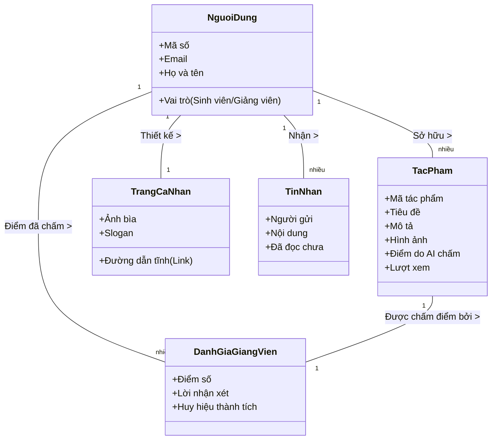
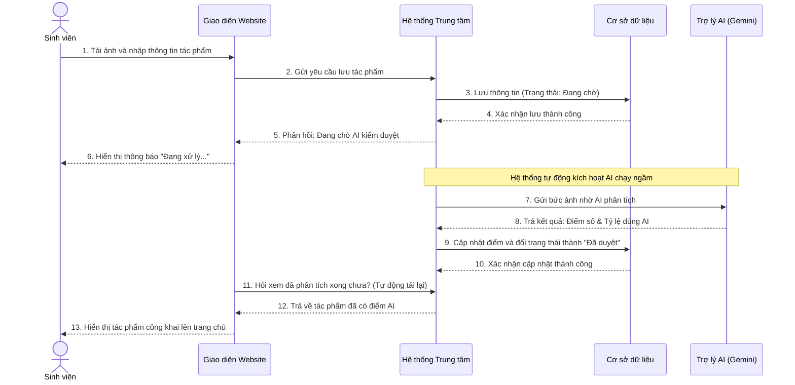
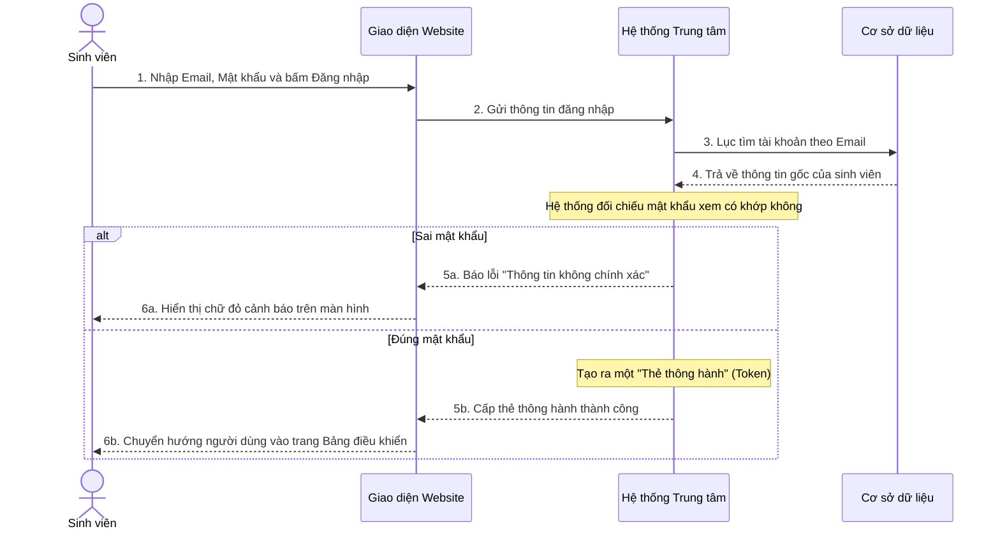
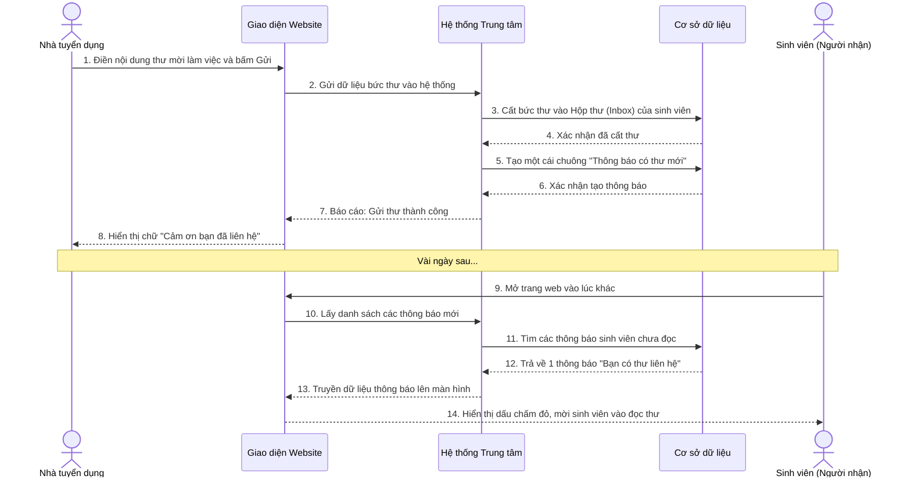
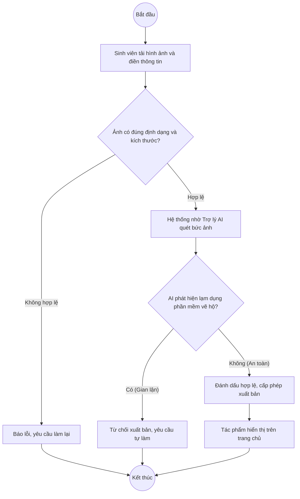
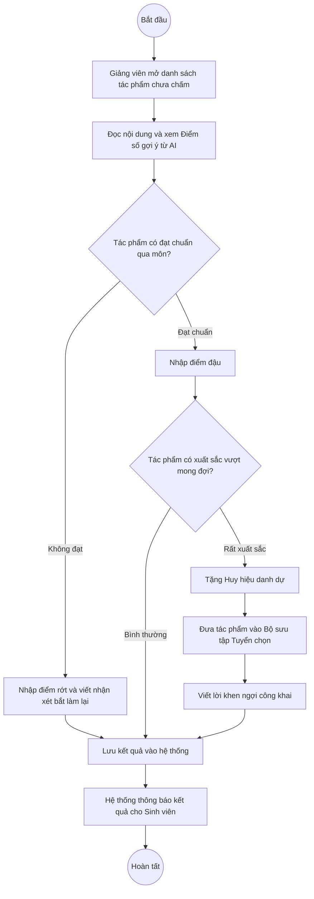
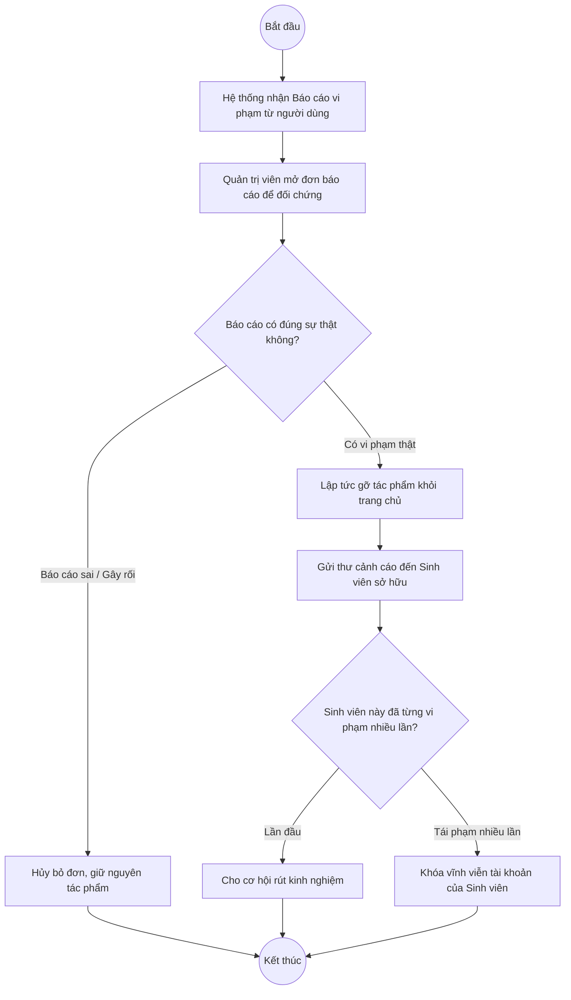

# TÀI LIỆU PHÂN TÍCH VÀ THIẾT KẾ HỆ THỐNG UEF DESIGN GALLERY
*(Dành cho việc viết báo cáo đồ án)*

Dưới đây là nội dung chi tiết được phân tích từ hệ thống hiện tại, bao gồm các công nghệ tiên tiến (đặc biệt là AI) và các sơ đồ thiết kế (UML Diagrams) được vẽ bằng Mermaid để bạn có thể chèn trực tiếp vào báo cáo.

---

## 1. CÁC CÔNG NGHỆ NÂNG CAO & AI ĐƯỢC ÁP DỤNG

### 1.1. Kiến trúc & Nền tảng Công nghệ
- **Giao diện người dùng (Frontend):** Sử dụng **React.js** để xây dựng ứng dụng trang đơn (SPA), mang lại trải nghiệm mượt mà, chuyển trang không cần tải lại, giống như đang dùng một phần mềm thực thụ.
- **Hệ thống xử lý trung tâm (Backend):** Được xây dựng bằng **ASP.NET Core (C#)**, làm nhiệm vụ nhận yêu cầu từ người dùng, xử lý các nghiệp vụ logic và kiểm tra bảo mật.
- **Cơ sở dữ liệu (Database):** Lưu trữ toàn bộ thông tin tài khoản, tác phẩm bằng **SQLite**. Hệ thống được thiết kế tách biệt hoàn toàn giữa phần Nhìn (Giao diện) và phần Xử lý (Backend).

### 1.2. Ứng dụng Trí tuệ nhân tạo (AI - Gemini API)
Hệ thống tích hợp **Trí tuệ nhân tạo (Google Gemini AI)** để thực hiện 2 tính năng chính:
- **Trợ lý học tập ảo:** Đóng vai trò như một người hướng dẫn, có thể trò chuyện và giải đáp thắc mắc chuyên môn về thiết kế cho sinh viên.
- **Kiểm duyệt Tác phẩm Tự động:** Ngay khi sinh viên tải ảnh lên, AI sẽ "nhìn" vào bức ảnh để đánh giá thẩm mỹ, chấm điểm sơ bộ và đặc biệt là phát hiện xem ảnh này do sinh viên tự vẽ hay dùng các công cụ AI (như Midjourney) tạo ra để chống gian lận.

---

## 2. USE CASE VÀ USE CASE TABLE

### 2.1. Sơ đồ Use Case
Hệ thống chia làm 4 nhóm người dùng chính:
1. **Sinh viên:** Tạo hồ sơ cá nhân, đăng tải tác phẩm, tương tác và trò chuyện.
2. **Giảng viên:** Chấm điểm, tặng huy hiệu, đưa tác phẩm giỏi vào bộ sưu tập giám tuyển.
3. **Quản trị viên:** Quản lý tài khoản, thay đổi giao diện trang chủ, giải quyết khiếu nại.
4. **Khách / Nhà tuyển dụng:** Xem tác phẩm công khai, tìm kiếm sinh viên và gửi thư liên hệ công việc.

```mermaid
usecaseDiagram
    actor "Sinh viên" as Student
    actor "Giảng viên" as Lecturer
    actor "Quản trị viên" as Admin
    actor "Khách / Nhà tuyển dụng" as Guest
    
    package "Hệ thống UEF Design Gallery" {
        usecase "Đăng nhập hệ thống" as UC_Auth
        
        usecase "Đăng tải & Quản lý Tác phẩm" as UC_Upload
        usecase "Thiết kế Trang cá nhân (Portfolio)" as UC_Portfolio
        usecase "Nhắn tin & Nhận thông báo" as UC_Messages
        
        usecase "Chấm điểm & Phản hồi" as UC_Grade
        usecase "Trao Huy hiệu & Giám tuyển" as UC_Collection
        
        usecase "Quản lý Người dùng & Giao diện" as UC_ManageSite
        usecase "Xử lý Báo cáo vi phạm" as UC_ManageReports
        
        usecase "Xem Tác phẩm Công khai" as UC_ViewPublic
        usecase "Gửi Thư Liên hệ công việc" as UC_Inquiry
        
        usecase "AI Tự động Kiểm duyệt" as UC_AI_Analyze
    }

    Guest --> UC_ViewPublic
    Guest --> UC_Inquiry
    
    Student --> UC_Auth
    Student --> UC_Upload
    Student --> UC_Portfolio
    Student --> UC_Messages
    Student --> UC_ViewPublic
    
    Lecturer --> UC_Auth
    Lecturer --> UC_Grade
    Lecturer --> UC_Collection
    Lecturer --> UC_Messages
    Lecturer --> UC_ViewPublic
    
    Admin --> UC_Auth
    Admin --> UC_ManageSite
    Admin --> UC_ManageReports
    
    UC_Upload ..> UC_AI_Analyze : <<include>>
```

---

## 3. CLASS DIAGRAM (Sơ đồ Lớp)

*Mô tả: Sơ đồ thể hiện mối quan hệ giữa các thành phần dữ liệu trong hệ thống (Tài khoản, Tác phẩm, Cài đặt cá nhân, Điểm số).*



---

## 4. SEQUENCE DIAGRAM (Sơ đồ Tuần tự) - Tối đa 3 sơ đồ

*Sơ đồ tuần tự mô tả các bước trao đổi thông tin giữa Người dùng, Giao diện Website, Hệ thống trung tâm và Cơ sở dữ liệu theo trình tự thời gian.*

### 4.1. Kịch bản 1: Đăng tải tác phẩm và AI tự động phân tích
**Mô tả (Non-tech):** Sinh viên đưa tác phẩm lên mạng. Hệ thống không cho hiển thị ngay mà âm thầm nhờ Trợ lý AI "soi" thử xem ảnh này có phải do máy vẽ không, sau đó mới cho xuất bản.



### 4.2. Kịch bản 2: Sinh viên đăng nhập vào hệ thống
**Mô tả (Non-tech):** Người dùng nhập tài khoản, hệ thống kiểm tra đối chiếu sổ sách. Nếu đúng người, hệ thống sẽ cấp một chiếc "thẻ thông hành" để người dùng đi lại thoải mái trong web mà không cần đăng nhập lại.



### 4.3. Kịch bản 3: Nhà tuyển dụng gửi thư liên hệ cho sinh viên
**Mô tả (Non-tech):** Một công ty xem hồ sơ thấy ưng ý, họ dùng khung thư liên hệ trên web để gửi lời mời làm việc trực tiếp vào Hộp thư của sinh viên. Sinh viên vào mạng sẽ thấy thông báo.



---

## 5. ACTIVITY DIAGRAM (Sơ đồ Hoạt động) - Tối đa 3 sơ đồ

*Sơ đồ hoạt động mô tả trình tự các bước thực hiện một công việc cụ thể, có các ngã rẽ (Điều kiện) để hệ thống biết phải làm gì trong từng trường hợp.*

### 5.1. Kịch bản 1: Quy trình đăng tải và kiểm duyệt tác phẩm
**Mô tả (Non-tech):** Sinh viên đưa ảnh lên, hệ thống sẽ chặn lại để kiểm tra xem file có bị lỗi hay dung lượng có quá nặng không. Nếu qua vòng 1, hệ thống nhờ AI soi xem bức ảnh này có phải hàng copy hay dùng máy vẽ hộ không. Nếu qua vòng 2, ảnh mới được phép xuất hiện trên web.



### 5.2. Kịch bản 2: Quy trình Giảng viên chấm điểm và giám tuyển
**Mô tả (Non-tech):** Giảng viên đi vòng quanh web xem đồ án. Gặp đồ án rớt thì báo sửa, gặp đồ án vừa đủ đậu thì cho điểm bình thường. Gặp đồ án cực kỳ xuất sắc thì ngoài cho điểm, giảng viên còn phong tặng danh hiệu và ghim lên bảng vàng danh dự của trường.



### 5.3. Kịch bản 3: Quy trình xử lý Báo cáo vi phạm của Quản trị viên
**Mô tả (Non-tech):** Có người dùng nghi ngờ một bức tranh là đồ ăn cắp bản quyền nên bấm nút "Báo cáo". Quản trị viên (Admin) sẽ vào kiểm tra. Nếu báo cáo láo thì bỏ qua, nếu đúng là ăn cắp thật thì xóa tranh. Nếu sinh viên ăn cắp nhiều lần thì khóa luôn tài khoản.


